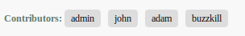

## Features

- List posters (contributors) in forum topics
- List posters (contributors) for comments
- Limit the number of contributors to display or not.

## Installation

1. Download, extract and place the contributors folder in your plugin directory.
2. Install and configure the plugin in Administration panel.
3. Add the tags desired in comments.tpl or forums.posts.tpl

You can either list the contributors by using a resource list or template tags and block. A resource list is just a list of contributors based on a resource, separated by a separator configured in the administration panel.

## Examples

All of these examples can be used in comments.tpl and forums.posts.tpl. 

### Display using template tags

##### Example 1: Display users using avatars only ( requires userimages plugin )


```
<!-- IF {PHP.contributors_count} > 0 -->
	<!-- BEGIN: CONTRIBUTOR_ROW -->
		<a title="{CONTRIBUTOR_NAME}" href="{CONTRIBUTOR_URL}">
		<!-- IF {CONTRIBUTOR_AVATAR_SRC} -->
			
		<!-- ELSE -->
			
		<!-- ENDIF -->
		</a>
	<!-- END: CONTRIBUTOR_ROW -->
<!-- ELSE -->
	There are currently no contributors.
<!-- ENDIF -->
```

##### Example 2: Display users using a link




```
<!-- IF {PHP.contributors_count} > 0 -->
    <strong>Contributors:</strong>
    <!-- BEGIN: CONTRIBUTOR_ROW -->
        <span style="padding: 4px 8px; border-radius: 4px; background-color: #ddd;">{CONTRIBUTOR_LINK}</span> &nbsp;
    <!-- END: CONTRIBUTOR_ROW -->
    <!-- IF {PHP.contributors_count_diff} > 0 -->
    	and {PHP.contributors_count_diff} others.
    <!-- ENDIF -->
<!-- ELSE -->
    There are currently no contributors.
<!-- ENDIF -->
```

### Display using template variables and resources

To override {PHP.contributor_list}, define `$R['contributors_forums_list']` for forums posts and `$R['contributors_comments_list']` for comments contributors in your theme's file.

__Available parameters__: {$id}, {$name}, {$link}, {$gender}, {$country}, {$countryflag}, {$url}, {$avatar}, {$avatar_src}

##### Example 1: Resource list display


```
<!-- IF {PHP.contributors_count} > 0 -->
	Contributors: {PHP.contributors_list}<!-- IF {PHP.contributors_count_diff} > 0 --> and {PHP.contributors_count_diff} others.<!-- ENDIF -->
<!-- ELSE -->
	There are currently no contributors.
<!-- ENDIF -->
```

## Available Template Variables

- `{PHP.contributors_count}`: Total number of contributors for the current item
- `{PHP.contributors_count_difference}`: Number of contributors that became hidden due to limiting number of contributors set in the plugin's configurations.

## Available Tags

### comments.tpl, forums.posts.tpl

In comments.tpl, the following must be inside `COMMENTS` block. 

For forums.posts.tpl, the following must be inside `MAIN` block.

__In block:__ `CONTRIBUTOR_ROW`

- {CONTRIBUTOR_ID}
- {CONTRIBUTOR_NAME}
- {CONTRIBUTOR_LINK}
- {CONTRIBUTOR_GENDER}
- {CONTRIBUTOR_COUNTRY}
- {CONTRIBUTOR_COUNTRYFLAG}
- {CONTRIBUTOR_URL}

